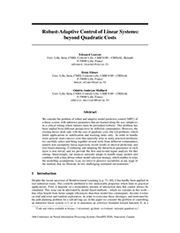

# Abstract

We consider the problem of robust and adaptive model predictive control (MPC) of a linear system, with unknown parameters that are learned along the way (adaptive), in a critical setting where failures must be prevented (robust). This problem has been studied from different perspectives by different communities. However, the existing theory deals only with the case of quadratic costs (the LQ problem), which limits applications to stabilisation and tracking tasks only. In order to handle more general (non-convex) costs that naturally arise in many practical problems, we carefully select and bring together several tools from different communities, namely non-asymptotic linear regression, recent results in interval prediction, and tree-based planning. Combining and adapting the theoretical guarantees at each layer is non trivial, and we provide the first end-to-end regret analysis for this setting. Interestingly, our analysis naturally adapts to handle many models and combines with a data-driven robust model selection strategy, which enables to relax the modelling assumptions. Last, we strive to preserve tractability at any stage of the method, that we illustrate on two challenging simulated environments.

----------------------------
# Videos

<p align="center"><iframe width="800" height="400" src="https://www.youtube.com/embed/jr2yi6Lf0bM" frameborder="0" allow="autoplay; encrypted-media" allowfullscreen></iframe></p>
<p align="center"><iframe width="800" height="400" src="https://www.youtube.com/embed/DhoJAmJDau4" frameborder="0" allow="autoplay; encrypted-media" allowfullscreen></iframe></p>

----------------------------

# Paper and Bibtex

<div style="display: flex;">
<div style="flex: 0 0 15em;">
	<a href="">
		
		<br>
		<h2>[Paper]</h2>
	</a>
</div>
<div style="flex: auto" markdown="1">

## Citation

Leurent, E., Efimov, D., and Maillard, O-A., 2020.<br>
*Robust-Adaptive Control of Linear Systems: beyond Quadratic Costs.* In Advances in Neural Information Processing Systems.

## [[Bibtex]]()

```
@incollection{leurent2020robust,
    title={Robust-Adaptive Control of Linear Systems:
    	beyond Quadratic Costs},
    author={Edouard Leurent and Denis Efimov and
    	Odalric-Ambrym Maillard},
    booktitle={Advances in Neural Information
    	Processing Systems 33},
    publisher={Curran Associates, Inc.},
    year={2020},
}
```
</div>
</div>

----------------------------
# Instructions

## Installation

1. Install the [rl-agents](https://github.com/eleurent/rl-agents) implementations, and clone the repository.

`pip install --user git+https://github.com/eleurent/rl-agents`

2. Install the [obstacle-env](https://github.com/eleurent/obstacle-env) environment

`pip install --user git+https://github.com/eleurent/obstacle-env`

3. Install the [highway-env](https://github.com/eleurent/highway-env) environment

`pip install --user git+https://github.com/eleurent/highway-env`

## Instructions

The experiments can be reproduced by running:

```
cd <path-to-rl-agents>/scripts
```

### Obstacle avoidance with unknown friction

```
python experiments.py configs/ObstacleEnv/env_obs_state.json configs/ObstacleEnv/agents/oracle.json
python experiments.py configs/ObstacleEnv/env_obs_state.json configs/ObstacleEnv/agents/nominal.json
python experiments.py configs/ObstacleEnv/env_obs_state.json configs/ObstacleEnv/agents/robust-epc.json
```

### Motion planning for an autonomous vehicle

```
python experiments.py configs/IntersectionEnv/env_multi_model.json configs/IntersectionEnv/agents/Robust/oracle.json
python experiments.py configs/IntersectionEnv/env_multi_model.json configs/IntersectionEnv/agents/Robust/known_route.json
python experiments.py configs/IntersectionEnv/env_multi_model.json configs/IntersectionEnv/agents/Robust/minimum_error_route.json
python experiments.py configs/IntersectionEnv/env_multi_model.json configs/IntersectionEnv/agents/Robust/robust-epc.json
```

The results will appear in the `scripts/out` directory.

----------------------------

# Acknowledgements

This work was supported by the French Ministry of Higher Education and Research, and CPER Nord-Pas de Calais/FEDER DATA Advanced data science and technologies 2015-2020.
